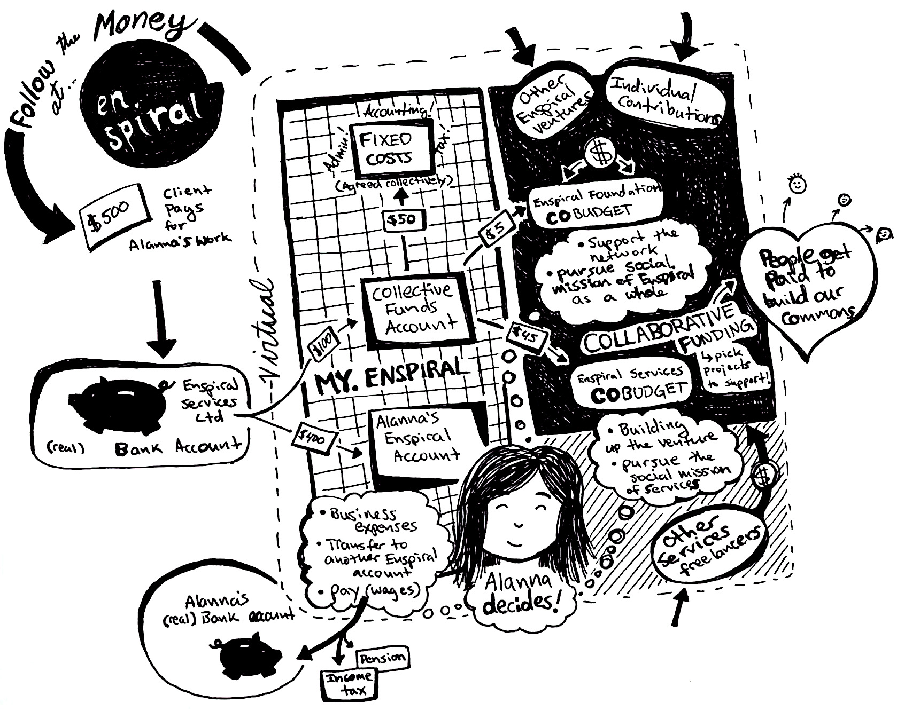

# Money

A lot of what makes Enspiral special is how we deal with money. Read more about those processes in this chapter.

* [Collaborative Funding](collabfunding.md): how to get money out of Cobudget
* [Variable Contributions](finances_variable_contributions.md): how to give money to Enspiral Foundation
* [Financial Transparency](financial_transparency.md): where you can see our bank balances.

Money at Enspiral is governed by the [Financial Agreement](https://github.com/enspiral/handbook/tree/d3234f4c1fe3afc87e5231beeb2d3926aee696d2/agreements/financial.html).

